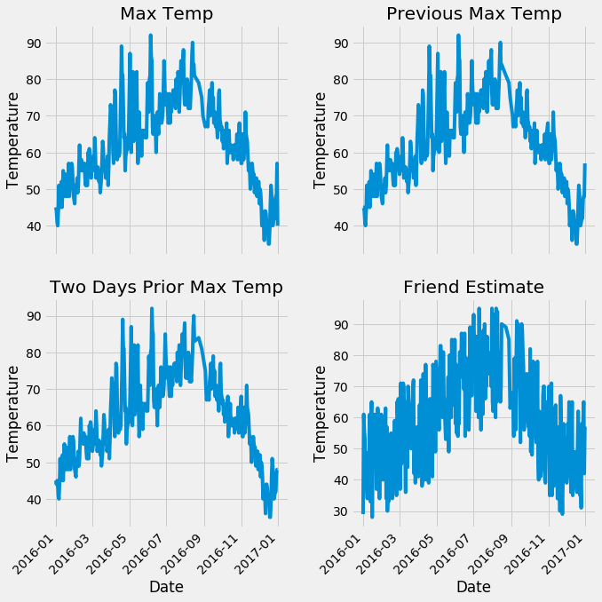
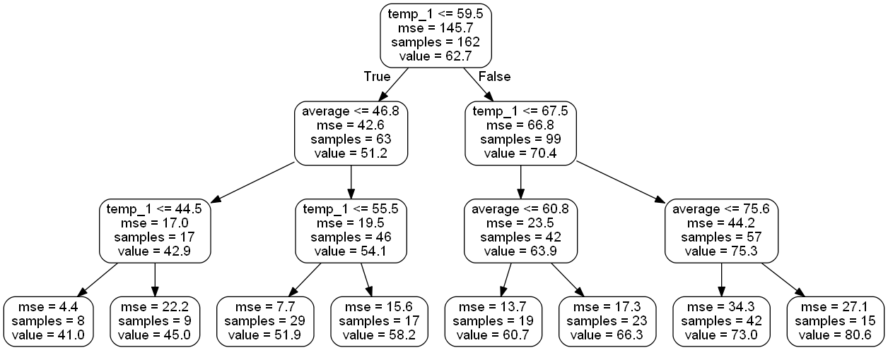
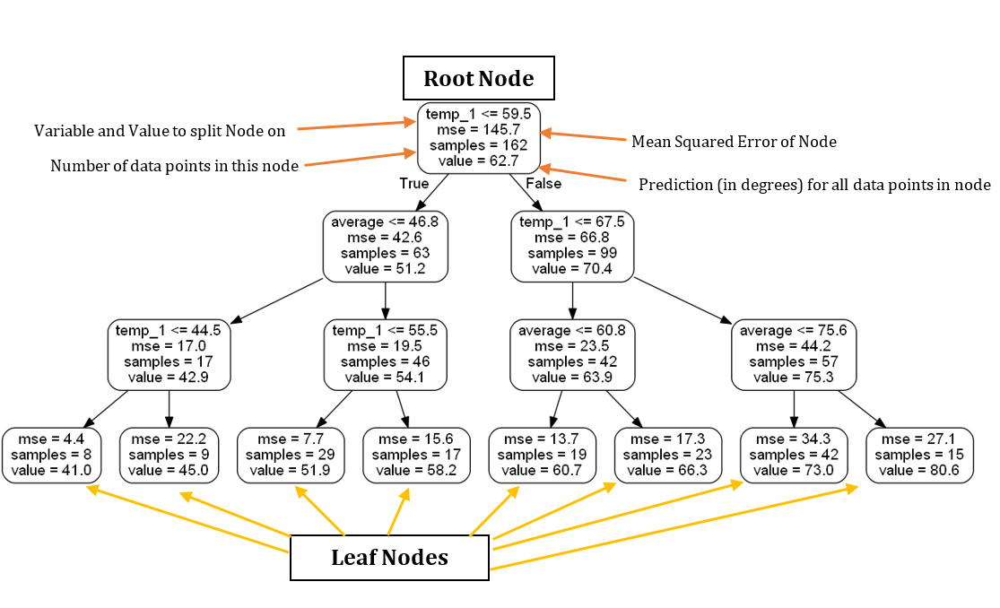
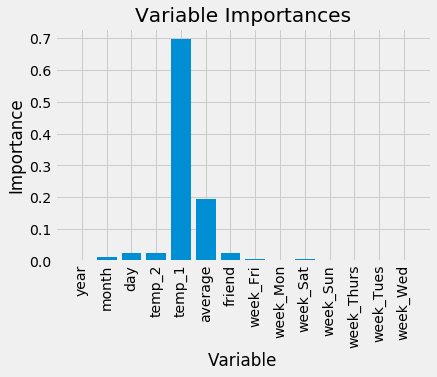
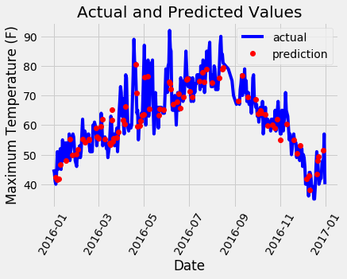
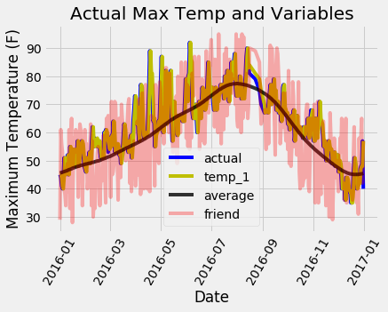

# Ask Question

Can we predict the maximum temperature tomorrow for Seattle, Washington given one year of historical data? 

The data we have available is the maximum temperatures in Seattle from the National Oceanic and Atmospheric Administration's (NOAA) [Climate Data Online Tool](https://www.ncdc.noaa.gov/cdo-web/).

# Data Acqusition


```python
# Pandas is used for data manipulation
import pandas as pd

# Read in data as pandas dataframe and display first 5 rows
features = pd.read_csv('data/temps.csv')
features.head(5)
```


<div>
<style>
    .dataframe thead tr:only-child th {
        text-align: right;
    }

    .dataframe thead th {
        text-align: left;
    }

    .dataframe tbody tr th {
        vertical-align: top;
    }
</style>
<table border="1" class="dataframe">
  <thead>
    <tr style="text-align: right;">
      <th></th>
      <th>year</th>
      <th>month</th>
      <th>day</th>
      <th>week</th>
      <th>temp_2</th>
      <th>temp_1</th>
      <th>average</th>
      <th>actual</th>
      <th>friend</th>
    </tr>
  </thead>
  <tbody>
    <tr>
      <th>0</th>
      <td>2016</td>
      <td>1</td>
      <td>1</td>
      <td>Fri</td>
      <td>45</td>
      <td>45</td>
      <td>45.6</td>
      <td>45</td>
      <td>29</td>
    </tr>
    <tr>
      <th>1</th>
      <td>2016</td>
      <td>1</td>
      <td>2</td>
      <td>Sat</td>
      <td>44</td>
      <td>45</td>
      <td>45.7</td>
      <td>44</td>
      <td>61</td>
    </tr>
    <tr>
      <th>2</th>
      <td>2016</td>
      <td>1</td>
      <td>3</td>
      <td>Sun</td>
      <td>45</td>
      <td>44</td>
      <td>45.8</td>
      <td>41</td>
      <td>56</td>
    </tr>
    <tr>
      <th>3</th>
      <td>2016</td>
      <td>1</td>
      <td>4</td>
      <td>Mon</td>
      <td>44</td>
      <td>41</td>
      <td>45.9</td>
      <td>40</td>
      <td>53</td>
    </tr>
    <tr>
      <th>4</th>
      <td>2016</td>
      <td>1</td>
      <td>5</td>
      <td>Tues</td>
      <td>41</td>
      <td>40</td>
      <td>46.0</td>
      <td>44</td>
      <td>41</td>
    </tr>
  </tbody>
</table>
</div>


# Identify Anomalies


```python
print('The shape of our features is:', features.shape)
```
    The shape of our features is: (348, 9)


```python
# Descriptive statistics for each column
features.describe()
```


<div>
<style>
    .dataframe thead tr:only-child th {
        text-align: right;
    }

    .dataframe thead th {
        text-align: left;
    }

    .dataframe tbody tr th {
        vertical-align: top;
    }
</style>
<table border="1" class="dataframe">
  <thead>
    <tr style="text-align: right;">
      <th></th>
      <th>year</th>
      <th>month</th>
      <th>day</th>
      <th>temp_2</th>
      <th>temp_1</th>
      <th>average</th>
      <th>actual</th>
      <th>friend</th>
    </tr>
  </thead>
  <tbody>
    <tr>
      <th>count</th>
      <td>348.0</td>
      <td>348.000000</td>
      <td>348.000000</td>
      <td>348.000000</td>
      <td>348.000000</td>
      <td>348.000000</td>
      <td>348.000000</td>
      <td>348.000000</td>
    </tr>
    <tr>
      <th>mean</th>
      <td>2016.0</td>
      <td>6.477011</td>
      <td>15.514368</td>
      <td>62.511494</td>
      <td>62.560345</td>
      <td>59.760632</td>
      <td>62.543103</td>
      <td>60.034483</td>
    </tr>
    <tr>
      <th>std</th>
      <td>0.0</td>
      <td>3.498380</td>
      <td>8.772982</td>
      <td>11.813019</td>
      <td>11.767406</td>
      <td>10.527306</td>
      <td>11.794146</td>
      <td>15.626179</td>
    </tr>
    <tr>
      <th>min</th>
      <td>2016.0</td>
      <td>1.000000</td>
      <td>1.000000</td>
      <td>35.000000</td>
      <td>35.000000</td>
      <td>45.100000</td>
      <td>35.000000</td>
      <td>28.000000</td>
    </tr>
    <tr>
      <th>25%</th>
      <td>2016.0</td>
      <td>3.000000</td>
      <td>8.000000</td>
      <td>54.000000</td>
      <td>54.000000</td>
      <td>49.975000</td>
      <td>54.000000</td>
      <td>47.750000</td>
    </tr>
    <tr>
      <th>50%</th>
      <td>2016.0</td>
      <td>6.000000</td>
      <td>15.000000</td>
      <td>62.500000</td>
      <td>62.500000</td>
      <td>58.200000</td>
      <td>62.500000</td>
      <td>60.000000</td>
    </tr>
    <tr>
      <th>75%</th>
      <td>2016.0</td>
      <td>10.000000</td>
      <td>23.000000</td>
      <td>71.000000</td>
      <td>71.000000</td>
      <td>69.025000</td>
      <td>71.000000</td>
      <td>71.000000</td>
    </tr>
    <tr>
      <th>max</th>
      <td>2016.0</td>
      <td>12.000000</td>
      <td>31.000000</td>
      <td>92.000000</td>
      <td>92.000000</td>
      <td>77.400000</td>
      <td>92.000000</td>
      <td>95.000000</td>
    </tr>
  </tbody>
</table>
</div>


```python
# Use datetime for dealing with dates
import datetime

# Get years, months, and days
years = features['year']
months = features['month']
days = features['day']

# List and then convert to datetime object
dates = [str(int(year)) + '-' + str(int(month)) + '-' + str(int(day)) for year, month, day in zip(years, months, days)]
dates = [datetime.datetime.strptime(date, '%Y-%m-%d') for date in dates]
```

```python
# Import matplotlib for plotting and use magic command for Jupyter Notebooks
import matplotlib.pyplot as plt

%matplotlib inline

# Set the style
plt.style.use('fivethirtyeight')
```

```python
# Set up the plotting layout
fig, ((ax1, ax2), (ax3, ax4)) = plt.subplots(nrows=2, ncols=2, figsize = (10,10))
fig.autofmt_xdate(rotation = 45)

# Actual max temperature measurement
ax1.plot(dates, features['actual'])
ax1.set_xlabel(''); ax1.set_ylabel('Temperature'); ax1.set_title('Max Temp')

# Temperature from 1 day ago
ax2.plot(dates, features['temp_1'])
ax2.set_xlabel(''); ax2.set_ylabel('Temperature'); ax2.set_title('Previous Max Temp')

# Temperature from 2 days ago
ax3.plot(dates, features['temp_2'])
ax3.set_xlabel('Date'); ax3.set_ylabel('Temperature'); ax3.set_title('Two Days Prior Max Temp')

# Friend Estimate
ax4.plot(dates, features['friend'])
ax4.set_xlabel('Date'); ax4.set_ylabel('Temperature'); ax4.set_title('Friend Estimate')

plt.tight_layout(pad=2)
```





# Data Preparation

### One-Hot Encoding

One hot encoding takes this:

| week |
|------|
| Mon  |
| Tue  |
| Wed  |
| Thu  |
| Fri  |

and converts it into:

| Mon | Tue | Wed | Thu | Fri |
|-----|-----|-----|-----|-----|
| 1   | 0   | 0   | 0   | 0   |
| 0   | 1   | 0   | 0   | 0   |
| 0   | 0   | 1   | 0   | 0   |
| 0   | 0   | 0   | 1   | 0   |
| 0   | 0   | 0   | 0   | 1   |


```python
# One-hot encode categorical features
features = pd.get_dummies(features)
features.head(5)
```


<div>
<style>
    .dataframe thead tr:only-child th {
        text-align: right;
    }

    .dataframe thead th {
        text-align: left;
    }

    .dataframe tbody tr th {
        vertical-align: top;
    }
</style>
<table border="1" class="dataframe">
  <thead>
    <tr style="text-align: right;">
      <th></th>
      <th>year</th>
      <th>month</th>
      <th>day</th>
      <th>temp_2</th>
      <th>temp_1</th>
      <th>average</th>
      <th>actual</th>
      <th>friend</th>
      <th>week_Fri</th>
      <th>week_Mon</th>
      <th>week_Sat</th>
      <th>week_Sun</th>
      <th>week_Thurs</th>
      <th>week_Tues</th>
      <th>week_Wed</th>
    </tr>
  </thead>
  <tbody>
    <tr>
      <th>0</th>
      <td>2016</td>
      <td>1</td>
      <td>1</td>
      <td>45</td>
      <td>45</td>
      <td>45.6</td>
      <td>45</td>
      <td>29</td>
      <td>1</td>
      <td>0</td>
      <td>0</td>
      <td>0</td>
      <td>0</td>
      <td>0</td>
      <td>0</td>
    </tr>
    <tr>
      <th>1</th>
      <td>2016</td>
      <td>1</td>
      <td>2</td>
      <td>44</td>
      <td>45</td>
      <td>45.7</td>
      <td>44</td>
      <td>61</td>
      <td>0</td>
      <td>0</td>
      <td>1</td>
      <td>0</td>
      <td>0</td>
      <td>0</td>
      <td>0</td>
    </tr>
    <tr>
      <th>2</th>
      <td>2016</td>
      <td>1</td>
      <td>3</td>
      <td>45</td>
      <td>44</td>
      <td>45.8</td>
      <td>41</td>
      <td>56</td>
      <td>0</td>
      <td>0</td>
      <td>0</td>
      <td>1</td>
      <td>0</td>
      <td>0</td>
      <td>0</td>
    </tr>
    <tr>
      <th>3</th>
      <td>2016</td>
      <td>1</td>
      <td>4</td>
      <td>44</td>
      <td>41</td>
      <td>45.9</td>
      <td>40</td>
      <td>53</td>
      <td>0</td>
      <td>1</td>
      <td>0</td>
      <td>0</td>
      <td>0</td>
      <td>0</td>
      <td>0</td>
    </tr>
    <tr>
      <th>4</th>
      <td>2016</td>
      <td>1</td>
      <td>5</td>
      <td>41</td>
      <td>40</td>
      <td>46.0</td>
      <td>44</td>
      <td>41</td>
      <td>0</td>
      <td>0</td>
      <td>0</td>
      <td>0</td>
      <td>0</td>
      <td>1</td>
      <td>0</td>
    </tr>
  </tbody>
</table>
</div>


```python
print('Shape of features after one-hot encoding:', features.shape)
```
    Shape of features after one-hot encoding: (348, 15)


### Features and Labels and Convert Data to Arrays


```python
# Use numpy to convert to arrays
import numpy as np

# Labels are the values we want to predict
labels = np.array(features['actual'])

# Remove the labels from the features
# axis 1 refers to the columns
features= features.drop('actual', axis = 1)

# Saving feature names for later use
feature_list = list(features.columns)

# Convert to numpy array
features = np.array(features)
```
### Training and Testing Sets


```python
# Using Skicit-learn to split data into training and testing sets
from sklearn.model_selection import train_test_split

# Split the data into training and testing sets
train_features, test_features, train_labels, test_labels = train_test_split(features, labels, test_size = 0.25,
                                                                           random_state = 42)
```

```python
print('Training Features Shape:', train_features.shape)
print('Training Labels Shape:', train_labels.shape)
print('Testing Features Shape:', test_features.shape)
print('Testing Labels Shape:', test_labels.shape)
```
    Training Features Shape: (261, 14)
    Training Labels Shape: (261,)
    Testing Features Shape: (87, 14)
    Testing Labels Shape: (87,)


# Establish Baseline


```python
# The baseline predictions are the historical averages
baseline_preds = test_features[:, feature_list.index('average')]

# Baseline errors, and display average baseline error
baseline_errors = abs(baseline_preds - test_labels)
print('Average baseline error: ', round(np.mean(baseline_errors), 2), 'degrees.')
```
    Average baseline error:  5.06 degrees.


# Train Model


```python
# Import the model we are using
from sklearn.ensemble import RandomForestRegressor

# Instantiate model 
rf = RandomForestRegressor(n_estimators= 1000, random_state=42)

# Train the model on training data
rf.fit(train_features, train_labels);
```
# Make Predictions on Test Data


```python
# Use the forest's predict method on the test data
predictions = rf.predict(test_features)

# Calculate the absolute errors
errors = abs(predictions - test_labels)

# Print out the mean absolute error (mae)
print('Mean Absolute Error:', round(np.mean(errors), 2), 'degrees.')

```
    Mean Absolute Error: 3.83 degrees.


# Determine Performance Metrics


```python
# Calculate mean absolute percentage error (MAPE)
mape = 100 * (errors / test_labels)

# Calculate and display accuracy
accuracy = 100 - np.mean(mape)
print('Accuracy:', round(accuracy, 2), '%.')
```
    Accuracy: 93.99 %.


# Improve Model if Necessary

We can create models with different hyperparameters to try and boost performance. The only way to find the best ones
are to try a few and evaluate them! 


```python
rf_new = RandomForestRegressor(n_estimators = 100, criterion = 'mse', max_depth = None, 
                               min_samples_split = 2, min_samples_leaf = 1)
```
# Interpret Model Results

## Visualizing a Single Decision Tree


```python
# Import tools needed for visualization
from sklearn.tree import export_graphviz
import pydot

# Pull out one tree from the forest
tree = rf.estimators_[5]

# Export the image to a dot file
export_graphviz(tree, out_file = 'tree.dot', feature_names = feature_list, rounded = True, precision = 1)

# Use dot file to create a graph
(graph, ) = pydot.graph_from_dot_file('tree.dot')

# Write graph to a png file
graph.write_png('tree.png'); 
```


```python
print('The depth of this tree is:', tree.tree_.max_depth)
```
    The depth of this tree is: 15


Smaller tree for visualization.


```python
# Limit depth of tree to 2 levels
rf_small = RandomForestRegressor(n_estimators=10, max_depth = 3, random_state=42)
rf_small.fit(train_features, train_labels)

# Extract the small tree
tree_small = rf_small.estimators_[5]

# Save the tree as a png image
export_graphviz(tree_small, out_file = 'small_tree.dot', feature_names = feature_list, rounded = True, precision = 1)

(graph, ) = pydot.graph_from_dot_file('small_tree.dot')

graph.write_png('small_tree.png');
```


### Annotated Version of Tree



## Variable Importances


```python
# Get numerical feature importances
importances = list(rf.feature_importances_)

# List of tuples with variable and importance
feature_importances = [(feature, round(importance, 2)) for feature, importance in zip(feature_list, importances)]

# Sort the feature importances by most important first
feature_importances = sorted(feature_importances, key = lambda x: x[1], reverse = True)

# Print out the feature and importances 
[print('Variable: {:20} Importance: {}'.format(*pair)) for pair in feature_importances];
```
    Variable: temp_1               Importance: 0.7
    Variable: average              Importance: 0.19
    Variable: day                  Importance: 0.03
    Variable: temp_2               Importance: 0.02
    Variable: friend               Importance: 0.02
    Variable: month                Importance: 0.01
    Variable: year                 Importance: 0.0
    Variable: week_Fri             Importance: 0.0
    Variable: week_Mon             Importance: 0.0
    Variable: week_Sat             Importance: 0.0
    Variable: week_Sun             Importance: 0.0
    Variable: week_Thurs           Importance: 0.0
    Variable: week_Tues            Importance: 0.0
    Variable: week_Wed             Importance: 0.0


### Model with Two Most Important Features


```python
# New random forest with only the two most important variables
rf_most_important = RandomForestRegressor(n_estimators= 1000, random_state=42)

# Extract the two most important features
important_indices = [feature_list.index('temp_1'), feature_list.index('average')]
train_important = train_features[:, important_indices]
test_important = test_features[:, important_indices]

# Train the random forest
rf_most_important.fit(train_important, train_labels)

# Make predictions and determine the error
predictions = rf_most_important.predict(test_important)

errors = abs(predictions - test_labels)

# Display the performance metrics
print('Mean Absolute Error:', round(np.mean(errors), 2), 'degrees.')

mape = np.mean(100 * (errors / test_labels))
accuracy = 100 - mape

print('Accuracy:', round(accuracy, 2), '%.')
```
    Mean Absolute Error: 3.9 degrees.
    Accuracy: 93.8 %.


## Visualizations

### Variable Importances


```python
# list of x locations for plotting
x_values = list(range(len(importances)))

# Make a bar chart
plt.bar(x_values, importances, orientation = 'vertical')

# Tick labels for x axis
plt.xticks(x_values, feature_list, rotation='vertical')

# Axis labels and title
plt.ylabel('Importance'); plt.xlabel('Variable'); plt.title('Variable Importances'); 
```





### Predictions and Actual Values


```python
# Dates of training values
months = features[:, feature_list.index('month')]
days = features[:, feature_list.index('day')]
years = features[:, feature_list.index('year')]

# List and then convert to datetime object
dates = [str(int(year)) + '-' + str(int(month)) + '-' + str(int(day)) for year, month, day in zip(years, months, days)]
dates = [datetime.datetime.strptime(date, '%Y-%m-%d') for date in dates]

# Dataframe with true values and dates
true_data = pd.DataFrame(data = {'date': dates, 'actual': labels})

# Dates of predictions
months = test_features[:, feature_list.index('month')]
days = test_features[:, feature_list.index('day')]
years = test_features[:, feature_list.index('year')]

# Column of dates
test_dates = [str(int(year)) + '-' + str(int(month)) + '-' + str(int(day)) for year, month, day in zip(years, months, days)]

# Convert to datetime objects
test_dates = [datetime.datetime.strptime(date, '%Y-%m-%d') for date in test_dates]

# Dataframe with predictions and dates
predictions_data = pd.DataFrame(data = {'date': test_dates, 'prediction': predictions}) 
```

```python
# Plot the actual values
plt.plot(true_data['date'], true_data['actual'], 'b-', label = 'actual')

# Plot the predicted values
plt.plot(predictions_data['date'], predictions_data['prediction'], 'ro', label = 'prediction')
plt.xticks(rotation = '60'); 
plt.legend()

# Graph labels
plt.xlabel('Date'); plt.ylabel('Maximum Temperature (F)'); plt.title('Actual and Predicted Values');

```





### Targets and Data Visualization


```python
# Make the data accessible for plotting
true_data['temp_1'] = features[:, feature_list.index('temp_1')]
true_data['average'] = features[:, feature_list.index('average')]
true_data['friend'] = features[:, feature_list.index('friend')]

# Plot all the data as lines
plt.plot(true_data['date'], true_data['actual'], 'b-', label  = 'actual', alpha = 1.0)
plt.plot(true_data['date'], true_data['temp_1'], 'y-', label  = 'temp_1', alpha = 1.0)
plt.plot(true_data['date'], true_data['average'], 'k-', label = 'average', alpha = 0.8)
plt.plot(true_data['date'], true_data['friend'], 'r-', label = 'friend', alpha = 0.3)

# Formatting plot
plt.legend(); plt.xticks(rotation = '60');

# Lables and title
plt.xlabel('Date'); plt.ylabel('Maximum Temperature (F)'); plt.title('Actual Max Temp and Variables');
```





```python

```